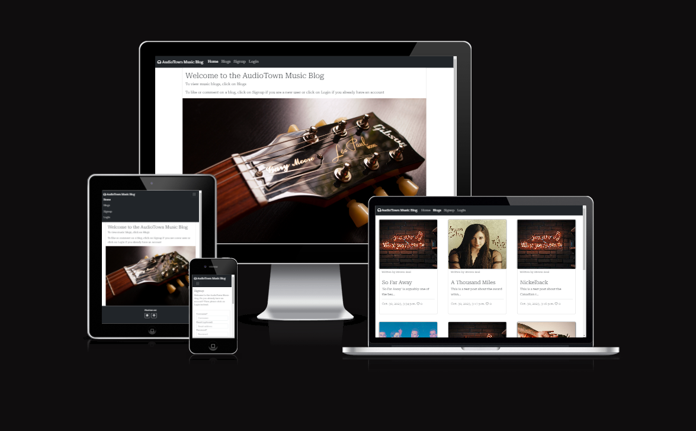

# Audoiotown Music Blog

The Audiotown Music Blog is a Django project which enables users read, like and comment on music blogs.

[View the live project here.](https://audiotown-music-blog-8325eb2cec3b.herokuapp.com/)

## User Experience (UX)

### Project Goals:

The project is designed to enable CRUD functionality for blogs.
Staff members are the only persons authorized to create, update and delete blogs.
Non-staff members on the other hand can read, like or comment on a blog.

### User stories
    - As a Site User, I can view blog posts in order to select a post to read
    - As a Site User, I can click on a particular post in order to read the post's content
    - As a Site Admin, I can perform CRUD functions on posts in order to manage posts
    - As a Site or Admin User, I can view the number of likes on each blog post in order to see the most interesting post
    - As a Site User, I can register an account on the blog app in order to comment on or like a post
    - As a Site or Admin User, I can view the comments on a blog post in order to to know people's opinion about the post
    - As a Site Admin, I can approve or disapprove comments in order to ensure that only acceptable comments are displayed to the public
    - As a Site User, I can comment on a post in order to to give my opinion about the post
    - As a Site User, I can like or unlike a post in order to let the author know whether or not the post is eye catching
    - As a Site Admin, I can log in and create a profile page for myself.
    - As a Site Admin, I can create a blog in the app after signing in.
    - As a Site Admin, I can log in and see my profile and associated posts.
    - As a Site Admin, I can log in and view my profile and access the respective posts from there.
    - As a Site Admin, I can edit my full name and bio in the Profile page.
    - As a Site User or Site Admin, I can view the blogs on different pages.

