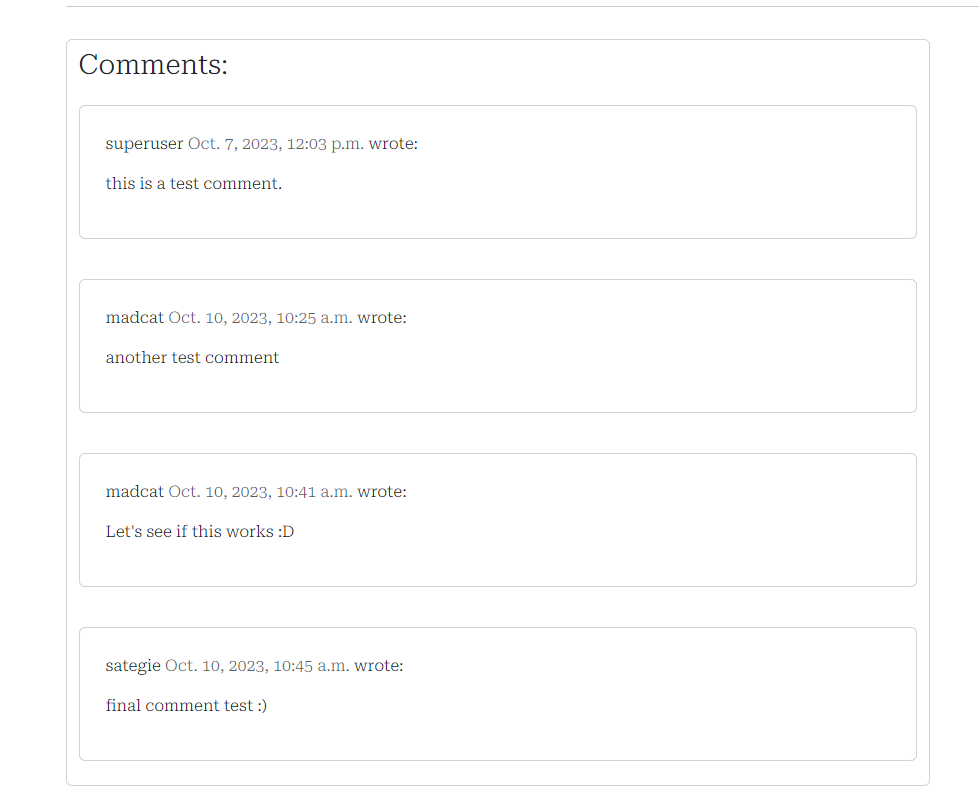

# Audoiotown Music Blog

The Audiotown Music Blog is a Django project which enables users read, like and comment on music blogs.

[View the live project here.](https://audiotown-music-blog-8325eb2cec3b.herokuapp.com/)

## User Experience (UX)

### Project Goals:

The project is designed to enable CRUD functionality for blogs.
Staff members are the only persons authorized to create, update and delete blogs.
Non-staff members on the other hand can read, like or comment on a blog.

### User stories
    - As a Site User, I can view blog posts in order to select a post to read
    - As a Site User, I can click on a particular post in order to read the post's content
    - As a Site Admin, I can perform CRUD functions on posts in order to manage posts
    - As a Site or Admin User, I can view the number of likes on each blog post in order to see the most interesting post
    - As a Site User, I can register an account on the blog app in order to comment on or like a post
    - As a Site or Admin User, I can view the comments on a blog post in order to to know people's opinion about the post
    - As a Site Admin, I can approve or disapprove comments in order to ensure that only acceptable comments are displayed to the public
    - As a Site User, I can comment on a post in order to to give my opinion about the post
    - As a Site User, I can like or unlike a post in order to let the author know whether or not the post is eye catching
    - As a Site Admin, I can log in and create a profile page for myself.
    - As a Site Admin, I can create a blog in the app after signing in.
    - As a Site Admin, I can log in and see my profile and associated posts.
    - As a Site Admin, I can log in and view my profile and access the respective posts from there.
    - As a Site Admin, I can edit my full name and bio in the Profile page.
    - As a Site User or Site Admin, I can view the blogs on different pages.

## Features

### Existing Features

- **Color Scheme**

  - The color combinations were chosen to keep the blog app simple.

  - Contrast was the major factor considered when choosing the colors.

- **Font Sizes**

  - The font sizes for the project are displayed using rem units to improve the readability on various screen sizes.

- **Landing Page**

    - The page that appears as soon as the URL loads is the home screen.
      - The home screen is has a Navbar and Footer which is consistent across all other pages.
      - The landing page's hero image is a picture of a guitar which fits well to the purpose of the app.
      - When a user logs in, a welcome message displays on the home screen with the username of the user(irrespective of staff membership).
  
        
        
        

- **Navbar**

  - The Navbar consists of the AudioTown Music Blog Logo, **Home**, **Blogs**, **Signup** and **Login**
  - If a non-staff member logs in, they are presented with only three options: **Home**, **Blogs** and **Logout**
  - If a staff member logs in, they are presented with five options: **Home**, **Blogs**, **Create Blog**, **Profile** and **Logout**

        
        

- **Blogs**

  - Whenever a user clicks on **Blogs**, all the blogs are displayed in boxes of 3 per row and 6 per page.
  - The user has the option to navigate to the next/previous page to view more blogs.
  - A user who is not logged in can click on blogs to read a blog and view comments, but does not have authorisation to like or comment on the blog.
  - Logged in users have the authorisation to read a blog, view comments, like/unlike or add a comment on a blog.
  - Staff members who click on a blog which they created themselves, have the option to edit or delete the blog.
  
        
        
        
        
        
        
        
        
        
        

- **Profile**

    - Whenever a staff member logs in, they have the option to click on Profile if one has been created for them on the backend.
    - A staff member who has a profile also has the ability to edit the fullname and bio in the blog app.
    - A staff member who has written blog posts will see the list of written blog posts within their profile

        
        

- **Logout**

    - Whenever a user logs out, they are asked to confirm if they want to logout or cancel.

        

- **Django Admin Page**

    - A django superuser account was created to administer the site on the backend.
    - Every subsequent staff-member needs to be created within the admin page
    - After a staff member account is created, the user can then access the admin page and carry out actions depending on the permissions assigned.

### Features Left to Implement

- **Icon for Logged-in user**
  
    - An icon to be displayed in the top right showing the currently logged in user.
  
- **Sharing Blogs**
  
  - The ability to share blog posts to social media after logging in.
  

