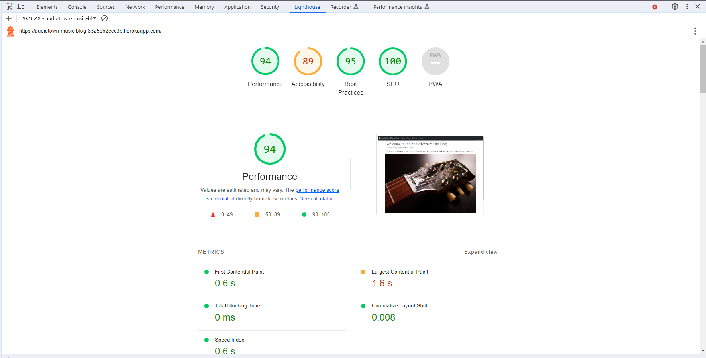

# Audoiotown Music Blog

The Audiotown Music Blog is a Django project which enables users read, like and comment on music blogs.

[View the live project here.](https://audiotown-music-blog-8325eb2cec3b.herokuapp.com/)

## User Experience (UX)

### Project Goals:

The project is designed to enable CRUD functionality for blogs.
Staff members are the only persons authorized to create, update and delete blogs.
Non-staff members on the other hand can read, like or comment on a blog.

### User stories
    - As a Site User, I can view blog posts in order to select a post to read
    - As a Site User, I can click on a particular post in order to read the post's content
    - As a Site Admin, I can perform CRUD functions on posts in order to manage posts
    - As a Site or Admin User, I can view the number of likes on each blog post in order to see the most interesting post
    - As a Site User, I can register an account on the blog app in order to comment on or like a post
    - As a Site or Admin User, I can view the comments on a blog post in order to to know people's opinion about the post
    - As a Site Admin, I can approve or disapprove comments in order to ensure that only acceptable comments are displayed to the public
    - As a Site User, I can comment on a post in order to to give my opinion about the post
    - As a Site User, I can like or unlike a post in order to let the author know whether or not the post is eye catching
    - As a Site Admin, I can log in and create a profile page for myself.
    - As a Site Admin, I can create a blog in the app after signing in.
    - As a Site Admin, I can log in and see my profile and associated posts.
    - As a Site Admin, I can log in and view my profile and access the respective posts from there.
    - As a Site Admin, I can edit my full name and bio in the Profile page.
    - As a Site User or Site Admin, I can view the blogs on different pages.

## Features

### Existing Features

- **Color Scheme**

  - The color combinations were chosen to keep the blog app simple.

  - Contrast was the major factor considered when choosing the colors.

- **Font Sizes**

  - The font sizes for the project are displayed using rem units to improve the readability on various screen sizes.

- **Landing Page**

    - The page that appears as soon as the URL loads is the home screen.
      - The home screen is has a Navbar and Footer which is consistent across all other pages.
      - The landing page's hero image is a picture of a guitar which fits well to the purpose of the app.
      - When a user logs in, a welcome message displays on the home screen with the username of the user(irrespective of staff membership).
  
        
        
        

- **Navbar**

  - The Navbar consists of the AudioTown Music Blog Logo, **Home**, **Blogs**, **Signup** and **Login**
  - If a non-staff member logs in, they are presented with only three options: **Home**, **Blogs** and **Logout**
  - If a staff member logs in, they are presented with five options: **Home**, **Blogs**, **Create Blog**, **Profile** and **Logout**

        
        

- **Blogs**

  - Whenever a user clicks on **Blogs**, all the blogs are displayed in boxes of 3 per row and 6 per page.
  - The user has the option to navigate to the next/previous page to view more blogs.
  - A user who is not logged in can click on blogs to read a blog and view comments, but does not have authorisation to like or comment on the blog.
  - Logged in users have the authorisation to read a blog, view comments, like/unlike or add a comment on a blog.
  - Staff members who click on a blog which they created themselves, have the option to edit or delete the blog.
  
        
        
        
        
        
        
        
        
        
        

- **Profile**

    - Whenever a staff member logs in, they have the option to click on Profile if one has been created for them on the backend.
    - A staff member who has a profile also has the ability to edit the fullname and bio in the blog app.
    - A staff member who has written blog posts will see the list of written blog posts within their profile

        
        

- **Logout**

    - Whenever a user logs out, they are asked to confirm if they want to logout or cancel.

        

- **Django Admin Page**

    - A django superuser account was created to administer the site on the backend.
    - Every subsequent staff-member needs to be created within the admin page
    - After a staff member account is created, the user can then access the admin page and carry out actions depending on the permissions assigned.

### Features Left to Implement

- **Icon for Logged-in user**
  
    - An icon to be displayed in the top right showing the currently logged in user.
  
- **Sharing Blogs**
  
  - The ability to share blog posts to social media after logging in.

## Project Design

### Database Models

- This project is hosted on Heroku and the PostgreSQL database is used.
- Cloudinary is used to store all blog images.
- Three custom models were created: **Post**, **Comment** and **Profile**
- All three models all have a Foreign Key relationship to the built in Django User model
  
        

## Technologies Used

### Languages

- HTML5
- CSS3
- JavaScript
- Python

### Frameworks/Libraries

- [Bootstrap:](https://getbootstrap.com/) Bootstrap CSS Framework for styling most parts of the project
- [Django:](https://www.djangoproject.com/) Main Python framework used
- [Django Allauth:](https://django-allauth.readthedocs.io/en/latest/index.html) Used for authentication
- [Cloudinary:](https://cloudinary.com/) Used to store all uploaded images
- [Coverage:](https://coverage.readthedocs.io/en/latest/index.html) Used to record the percentage of automated tests carried out
- [Django Crispy Forms:](https://django-crispy-forms.readthedocs.io/en/latest/) Used to simplify the rendering of Django forms.
- [Gunicorn:](https://gunicorn.org/) used as the web server to run Django on Heroku.
- [psycopg2:](https://pypi.org/project/psycopg2/) Used PostgreSQL database adapter.
- [Summernote:](https://github.com/summernote/django-summernote) Used to provide a WYSIWYG editor for blogs and uploading images.

### Technologies/Software

- [Am I Responsive:](http://ami.responsivedesign.is) Used to create the responsiveness image across different screen sizes
- [Chrome DevTools:](https://developer.chrome.com/docs/devtools/) Used for testing responsiveness and device compatibility
- [Font Awesome:](https://fontawesome.com/) Used to add icons in the project
- [Git:](https://git-scm.com/) Git was used for version control
- [GitHub:](https://github.com/) GitHub is used to store the project
- [Google Fonts:](https://fonts.google.com/) Used to import the Roboto and serif fonts for the project.
- [Heroku:](https://www.heroku.com/) Used for deployment and hosting of the application.
- [Elephant SQL:](https://customer.elephantsql.com/login) The database hosting service used in the project
- [HTML Validator:](https://validator.w3.org/) Used to validate the HTML
- [Lucidchart:](https://www.lucidchart.com/pages/) Used to create the Entity Relationship Diagram for the database models
- [W3 CSS Validator:](https://jigsaw.w3.org/css-validator/) Check your code for CSS validation.

## Testing

### Browser Compatibility

- The project was tested on the browsers listed below. The project worked as expected on all three browsers without any significant differences noticed.

  - Google Chrome Version 118.0.5993.117 (Official Build) (64-Bit)

  - Microsoft Edge Version 118.0.2088.76 (Official build) (64-bit)

  - Firefox Version 119.0 (64-Bit)

### Lighthouse

  - Lighthouse was used to test the project based on the following criteria: Performance, Accessibility, Best Practices and SEO. Google Chrome (Incognito Mode) was used.
  
    

### Validators

- HTML
    - No errors were found using the official W3C validator.

- CSS
    - No errors were found using the W3C CSS (jigsaw) validator.

- Python
    - No errors were found in the python files using Code Institute's PEP8 Python Linter.

  
  
  
  
  
  
  
  
  
  
  

### Automated Testing

- Django Testcase was primarily used to perform the automated testing
- Coverage was used to generate a summary of the automated tests carried out.
- A coverage of 89% was achieved
  
  

### Manual Testing Outcomes
  
  | **Test**         	| **Test Action**                                                                     	| **Expected Outcome**                                                                             	| **Result** 	|
|------------------	|-------------------------------------------------------------------------------------	|--------------------------------------------------------------------------------------------------	|------------	|
| Landing Page     	| Enter Page URL without signing in                                                   	| Following options are available: **Home**, **Blogs**, **Signup** and **Login**                   	| PASS       	|
| Landing Page     	| Sign in with non-staff member account                                               	| Following options are available: **Home**, **Blogs**, **Logout**                                 	| PASS       	|
| Landing Page     	| Sign in with staff member account                                                   	| Following options are available: **Home**, **Blogs**, **Create Blog**, **Profile**, **Logout**   	| PASS       	|
| Blogs            	| Click on Blogs icon without logging in                                              	| A list of blogs are shown                                                                        	| PASS       	|
| Blog Detail      	| Click on a single blog without logging in                                           	| The blog can be read and comments can be seen, but no option to add a comment or like the blog   	| PASS       	|
| Blog Detail      	| Click on a single blog after logging in                                             	| The blog can be read, comments can be seen, user has option to add a comment or like the blog    	| PASS       	|
| Blog Detail      	| Click on a single blog as an authenticated staff member who wrote the selected blog 	| The user has the option to edit or delete the blog                                               	| PASS       	|
| Comment          	| Post a comment on a blog                                                            	| A message appears informing that the comment is awaiting approval                                	| PASS       	|
| Profile          	| Cick on profile as an authenticated staff member who has a profile created          	| The user profile appears showing the profile picture, full name, bio and list of posts created   	| PASS       	|
| Posts in Profile 	| Click on a post which is listed in your profile as a staff member                   	| The user is redirected to the blog detail page to read the post                                  	| PASS       	|
| Edit Profile     	| Click on the option to edit profile                                                 	| The user is taken to a form to edit only the full name and bio                                   	| PASS       	|
| Create Blog      	| Click on the Create Blog option as a staff member                                   	| The user has the option to enter the title, upload an image for the blog and enter the blog text 	| PASS       	|
| Edit Blog        	| Click on Edit Blog as a staff member who wrote the blog                             	| The user is taken to a form to edit the blog                                                     	| PASS       	|
| Delete Blog      	| Click on Delete Blog as a staff member who wrote the blog                           	| The user is taken to a page to confirm whether the blog should be deleted or not                 	| PASS       	|
| Blog Image       	| Create a blog without uploading an image for the blog                               	| A default image is used to populate the image field                                              	| PASS       	|
| Logout           	| Click on the Logout button                                                          	| The user is asked to confirm if they want to logout and they have the option to cancel           	| PASS       	|

### Known bugs

- There are currently no known bugs

## Deployment

### PostgreSQL Database

ElephantSQL is the database hosting service used for this project

1. Navigate to elephantsql.com and click 'Get a managed database today'. When presented with options for differing plans, I chose the free 'Tiny Turtle' plan.
2. Select “Log in with GitHub” and authorize ElephantSQL with your selected GitHub account.
3. In the Create new team form:
    - Add a team name.
    - Read and agree to the Terms of Service.
    - Provide your email address.
    - Click “Create Team”.
4. Your account should now be created.
5. Now you will need to create your database. Navigate to your elephantsql.com dashboard, and click "Create New Instance".
6. Set up your plan:
    - Give your plan a Name (this is commonly the name of the project).
    - Select the Tiny Turtle (Free) plan.
    - You can leave the Tags field blank.
7. Select a data center near you.
8. Then click "Review".
9. Check your details are correct and then click "Create Instance".
10. Return to the ElephantSQL dashboard and click on the database instance name for the project.

### Deploy with Heroku

- Log in to Heroku at <https://heroku.com>
- From the Heroku dashboard, click the Create new app button. For a new account an icon will be visible on screen to allow you to Create an app, otherwise a link to this function is located under the New dropdown menu at the top right of the screen.
-  On the Create New App page, enter a unique name for the application and select region. Then click Create app.
-  On the Application Configuration page for the new app, click on the Resources tab.
- Next, click on Settings on the Application Configuration page and click on "Reveal Config Vars".
- Add a new Config Var called DISABLE_COLLECTSTATIC and assign it a value of 1, and click Add to save it. Remove this when releasing for Production.
- Add a new Config Var called SECRET_KEY and assign it a value - any random string of letters, digits and symbols, and click Add to save it.
- Add a new Config Var called DATABASE_URL and paste in the value for your ElephantSQL database, and click Add to save it.
- The settings.py file should be updated to use the DATABASE_URL and SECRET_KEY environment variable values as follows :

        DATABASES = {'default': dj_database_url.parse(os.environ.get('DATABASE_URL'))}

        SECRET_KEY = os.environ.get('SECRET_KEY')

-  In CodeAnywhere, in the project terminal window, to initialize the data model in the postgres database, run the command : python3 manage.py migrate
-  Update the requirements.txt file with all necessary supporting files by entering the command : pip freeze > requirements.txt
-  Commit and push any local changes to GitHub.
-  In order to be able to run the application on localhost, add SECRET_KEY and DATABASE_URL and their values to env.py

Connect GitHub Repo to Heroku App

- Navigate to Application Configuration page for the application on Heroku and click on the Deploy tab.
- Select GitHub as the Deployment Method and if prompted, confirm that you want to connect to GitHub. Enter and search for the required repository, then click on Connect to link them up..
- Scroll down the page and choose to either Automatically Deploy each time changes are pushed to GitHub, or Manually deploy - I chose the latter for the initial deployment to watch the build and then opted for Automatic Deployment.
- The application can be run from the Application Configuration page by clicking on the Open App button.
- Each time you push code from your GitHub Repo it will be automatically reflected in your Heroku App.

### Deploying to Production

In CodeAnywhere:

1. Set DEBUG flag to False in settings.py (**Very Important**)
2. Check the following line exists in settings.py to enable Summernote to work on the deployed environment (CORS security feature): X_FRAME_OPTIONS = 'SAMEORIGIN'
3. Update the requirements.txt file with all necessary supporting files by entering the command : pip freeze > requirements.txt
4. Commit and push code to GitHub
   
In the Heroku App:
1. Settings > Config Vars : Delete environment variable : DISABLE_COLLECTSTATIC
2. Click on Deploy Branch under the Deploy tab
